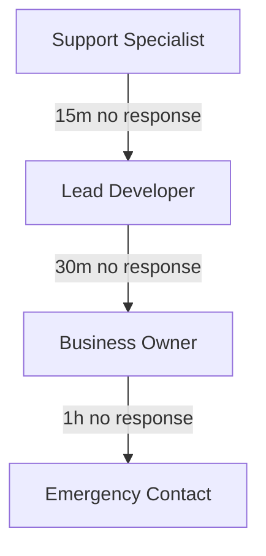

# CopysAI Emergency Response Protocol

## 1. Current System Status (May 2025)

### 1.1 Infrastructure Overview
```json
{
    "web_servers": {
        "count": 2,
        "type": "t3.medium",
        "location": "us-east-1"
    },
    "database": {
        "type": "RDS MySQL 8.0",
        "size": "t3.medium",
        "storage": "100GB"
    },
    "monitoring": {
        "system": "AWS CloudWatch",
        "metrics": ["CPU", "Memory", "Disk", "Network"]
    }
}
```

### 1.2 Critical Services
```bash
# Health Check Endpoints
curl -s https://api.copysai.com/health
curl -s https://app.copysai.com/health

# Database Connection
php artisan db:monitor

# Queue Status
php artisan queue:status
```

## 2. Emergency Categories and Response Times

### 2.1 Priority 1 (Response: 15 minutes)
- Complete service outage
- Database connectivity loss
- Payment system failure
- Security breach

### 2.2 Priority 2 (Response: 30 minutes)
- API degradation
- Scheduled post failures
- Performance issues
- Authentication problems

### 2.3 Priority 3 (Response: 2 hours)
- Non-critical feature issues
- Reporting delays
- UI/UX problems
- Minor functionality bugs

## 3. Response Procedures

### 3.1 Service Outage Response
```bash
# 1. Check System Status
for service in api app worker queue; do
    systemctl status copysai-$service
done

# 2. Check Error Logs
tail -f /var/log/copysai/error.log

# 3. Monitor Resources
top -b -n 1
df -h

# 4. Restart Services if Needed
sudo systemctl restart copysai-api
sudo systemctl restart copysai-worker
```

### 3.2 Database Emergency
```sql
-- Check Database Connection
SHOW PROCESSLIST;

-- Kill Hanging Queries
SELECT concat('KILL ',id,';')
FROM information_schema.processlist
WHERE time > 300;

-- Check Table Status
CHECK TABLE users, social_posts, schedules;
```

### 3.3 API Integration Issues
```php
# Check API Health
php artisan api:health-check

# Verify OAuth Tokens
php artisan oauth:verify-tokens

# Reset API Connections
php artisan api:reset-connections
```

## 4. Customer Communication

### 4.1 Automated Notifications
```php
# Send Status Update
php artisan notify:customers [
    --type=outage
    --severity=high
    --estimated-resolution="2 hours"
    --affected-services="Social Media Posting"
]

# Update Status Page
php artisan status:update [
    --status=investigating
    --message="We are investigating reports of posting delays"
]
```

### 4.2 Manual Follow-up
```php
# Get Affected Customers
php artisan customers:list-affected --incident=123

# Send Personal Updates
php artisan notify:custom [
    --template=incident-update
    --customers=affected
    --vars='{"resolution_details": "..."}'
]
```

## 5. System Recovery

### 5.1 Application Recovery
```bash
# Clear Application Cache
php artisan cache:clear
php artisan config:clear
php artisan route:clear

# Rebuild Queue Workers
php artisan queue:restart

# Verify Services
for service in nginx php-fpm redis-server mysql; do
    sudo service $service status
done
```

### 5.2 Data Recovery
```bash
# Backup Current State
timestamp=$(date +%Y%m%d_%H%M%S)
php artisan backup:run

# Restore from Backup if Needed
php artisan backup:restore --backup=latest

# Verify Data Integrity
php artisan db:check-integrity
```

## 6. Current Response Team

### 6.1 Primary Contacts
```yaml
Lead Developer:
  phone: [REDACTED]
  email: [REDACTED]
  response_time: 15 minutes

Support Lead:
  phone: [REDACTED]
  email: [REDACTED]
  response_time: 30 minutes

Business Owner:
  phone: [REDACTED]
  email: [REDACTED]
  response_time: 1 hour
```

### 6.2 Escalation Path


## 7. Post-Incident Procedures

### 7.1 Incident Documentation
```bash
# Generate Incident Report
php artisan incident:report [
    --id=INC-123
    --duration="2h 15m"
    --impact="146 users affected"
    --root-cause="API rate limit exceeded"
]

# Update Knowledge Base
php artisan kb:add-article [
    --title="Handling API Rate Limits"
    --category="Emergency Response"
    --content="lessons_learned.md"
]
```

### 7.2 Prevention Measures
```bash
# Update Monitoring
aws cloudwatch put-metric-alarm \
    --alarm-name api-rate-limit \
    --comparison-operator GreaterThanThreshold \
    --evaluation-periods 2 \
    --metric-name APICallCount \
    --namespace CopysAI \
    --period 300 \
    --threshold 80

# Implement Fixes
git checkout -b hotfix/api-rate-limiting
php artisan make:migration add_rate_limit_tracking
```

## 8. Known Limitations

### 8.1 Current Constraints
- Single region deployment
- No automated failover
- Limited after-hours support
- Manual intervention required

### 8.2 Improvement Roadmap
```yaml
Q3 2025:
  - Implement automated health checks
  - Set up status page
  - Create incident response runbooks

Q4 2025:
  - Multi-region deployment
  - Automated failover
  - 24/7 monitoring service
```
