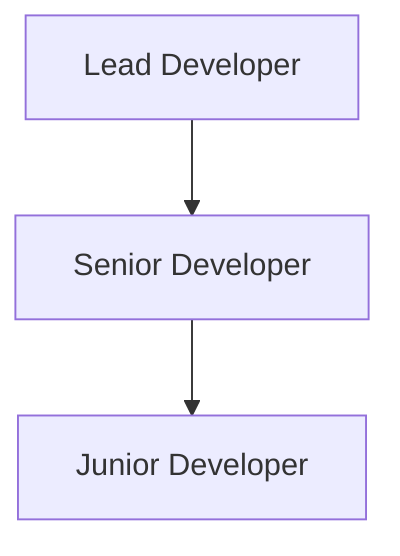
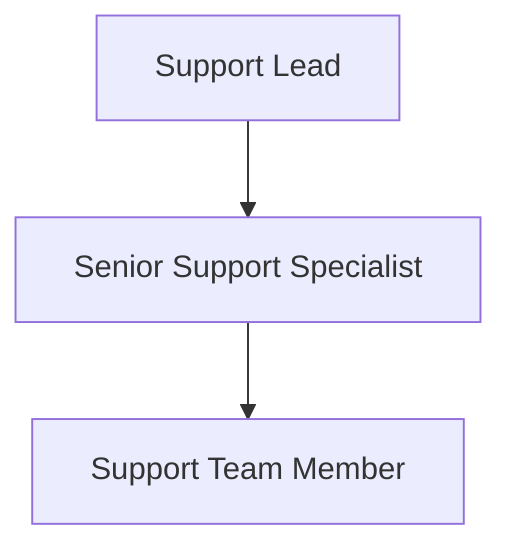

# CopysAI Leadership Succession Plan

## 1. Current Leadership Structure

### 1.1 Core Team (As of May 2025)
- Lead Developer/Technical Director
  - Current: [Name]
  - Tenure: [Duration]
  - Key Skills: Laravel, AWS, System Architecture

- Support & Operations Lead
  - Current: [Name]
  - Tenure: [Duration]
  - Key Skills: Customer Support, Social Media, Operations

- Business Owner/Product Manager
  - Current: [Name]
  - Tenure: [Duration]
  - Key Skills: Product Strategy, Business Development

### 1.2 Critical Knowledge Areas
- Technical Infrastructure
  ```json
  {
    "aws_services": ["EC2", "RDS", "S3", "SES"],
    "development_stack": ["Laravel", "Vue.js", "MySQL"],
    "api_integrations": ["Facebook", "Twitter", "Instagram", "LinkedIn"]
  }
  ```

- Business Operations
  ```json
  {
    "revenue_streams": ["Subscriptions", "API Access"],
    "key_metrics": ["MRR", "Customer Churn", "API Usage"],
    "pricing_strategy": "Tiered Subscription Model"
  }
  ```

## 2. Succession Scenarios

### 2.1 Technical Leadership

#### Primary Succession Path


#### Knowledge Transfer Checklist
```bash
# Infrastructure Documentation
./scripts/generate_infrastructure_docs.sh

# Access Management
 php artisan auth:list-permissions
 php artisan generate:access-matrix

# Deployment Procedures
 cat ./deployment/README.md
```

### 2.2 Support Leadership

#### Primary Succession Path


#### Critical Procedures
```php
# Customer Communication Templates
php artisan templates:list

# Support Workflows
php artisan support:show-workflows

# Escalation Paths
php artisan support:escalation-matrix
```

## 3. Emergency Handover Procedures

### 3.1 Technical Systems

#### Access Transfer
```bash
# Generate emergency access report
./scripts/audit_access.sh

# Create emergency access bundle
php artisan access:emergency-bundle
```

#### Critical Passwords
```json
{
    "locations": [
        "AWS Root Credentials: 1Password Vault",
        "Database Credentials: .env.production",
        "API Keys: Secure Storage"
    ]
}
```

### 3.2 Business Operations

#### Customer Data
```sql
-- Export critical customer data
SELECT 
    business_name,
    subscription_tier,
    renewal_date,
    monthly_value
FROM customers
WHERE status = 'active'
ORDER BY monthly_value DESC;
```

#### Vendor Relationships
```json
{
    "payment_processor": "Stripe",
    "cloud_provider": "AWS",
    "email_service": "AWS SES",
    "monitoring": "AWS CloudWatch"
}
```

## 4. Immediate Actions by Role

### 4.1 Technical Handover
```bash
# Day 1 Checklist
- [ ] Access audit
- [ ] Infrastructure documentation review
- [ ] Deployment credential verification
- [ ] Team notification

# Week 1 Priorities
- [ ] Code repository access
- [ ] AWS console familiarity
- [ ] Database backup verification
- [ ] API health checks
```

### 4.2 Support Handover
```bash
# Day 1 Checklist
- [ ] Customer communication templates
- [ ] Support tool access
- [ ] Team notification
- [ ] Current ticket review

# Week 1 Priorities
- [ ] Customer contact list
- [ ] SLA review
- [ ] Process documentation
- [ ] Team training schedule
```

## 5. Current Limitations

### 5.1 Technical Dependencies
- Single technical lead with comprehensive knowledge
- Limited documentation of legacy systems
- Custom integrations requiring specific expertise
- No dedicated DevOps team

### 5.2 Operational Constraints
- Small team size limits backup options
- Limited cross-training opportunities
- No dedicated HR department
- Budget constraints for additional hires

## 6. Risk Mitigation

### 6.1 Short-term Actions (0-3 months)
```bash
# Priority Tasks
- [ ] Document all AWS configurations
- [ ] Create system architecture diagrams
- [ ] Establish backup admin accounts
- [ ] Cross-train support team members
```

### 6.2 Long-term Strategy (3-12 months)
```bash
# Strategic Goals
- [ ] Hire additional developer
- [ ] Implement automated documentation
- [ ] Create training program
- [ ] Establish formal succession paths
```

## 7. Review Schedule

### 7.1 Regular Reviews
- Monthly: Documentation updates
- Quarterly: Skills assessment
- Semi-annual: Succession plan review
- Annual: Full plan revision

### 7.2 Triggers for Immediate Review
- Team member resignation
- Significant system changes
- Business structure changes
- Acquisition discussions
